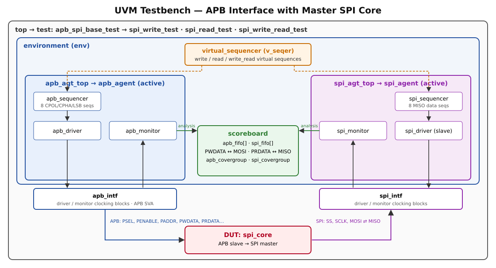
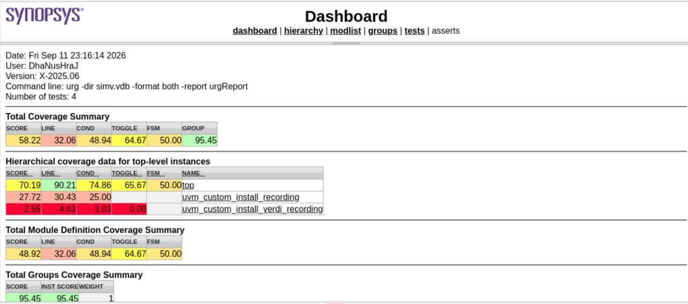
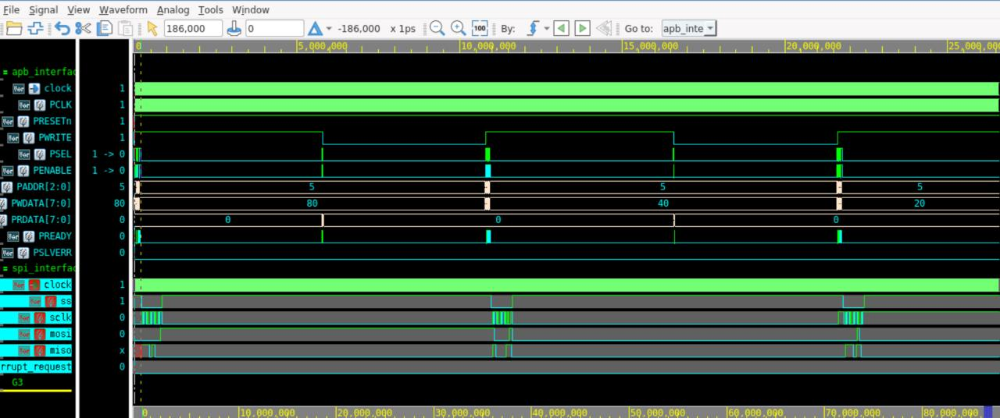

# APB Interface with Master SPI Core — UVM Verification

A **UVM verification environment** for an AMBA APB-to-SPI master core. An active APB agent programs the core's registers and writes transmit data. An active SPI agent acts as the SPI slave: it drives MISO and monitors MOSI. A scoreboard checks data end-to-end across the two protocol domains, in **all four SPI modes (CPOL/CPHA)** and in both **LSB-first and MSB-first** order.

**Highlights:**
- Two-agent UVM environment with a virtual sequencer
- APB → SPI and SPI → APB data checking
- Functional coverage with covergroups
- APB protocol assertions
- Simulation on Synopsys VCS, debug in Verdi, coverage merged with URG

---

## Tools & Technologies

| Category | Used |
|---|---|
| **Language / methodology** | SystemVerilog, UVM |
| **Simulator** | Synopsys VCS X-2025.06 |
| **Waveform debug** | Synopsys Verdi (FSDB dump of design and SVA) |
| **Coverage** | Synopsys URG: code coverage (line, condition, toggle, FSM) and functional coverage |
| **Protocols** | AMBA APB, SPI (Serial Peripheral Interface) |
| **Platform** | Linux |

---

## Testbench Architecture

<p align="center"></p>

| Component | File | Role |
|---|---|---|
| `top` | [`top/top.sv`](top/top.sv) | Clock, APB and SPI interfaces, DUT instance, `uvm_config_db` handles, FSDB dump, `run_test()` |
| `apb_spi_base_test` and tests | [`test/test.sv`](test/test.sv) | Builds the environment configuration (both agents active, scoreboard and virtual sequencer on) and starts a virtual sequence |
| `environment` | [`env/env.sv`](env/env.sv) | Creates both agent tops, the scoreboard and the virtual sequencer. Connects monitor analysis ports to the scoreboard FIFOs. |
| `virtual_sequencer` | [`env/virtual_sequencer.sv`](env/virtual_sequencer.sv) | Holds handles to the APB and SPI sequencers |
| Virtual sequences | [`env/write_virtual_sequence.sv`](env/write_virtual_sequence.sv), [`read_…`](env/read_virtual_sequence.sv), [`write_read_…`](env/write_read_virtual_sequence.sv) | Coordinate APB register programming with the matching SPI-slave response for each mode |
| `scoreboard` | [`env/scoreboard.sv`](env/scoreboard.sv) | Analysis FIFOs, data comparison, functional covergroups |
| APB agent | [`apb_agent/`](apb_agent/) | Transaction, sequencer, driver (APB SETUP → ACCESS timing), monitor (samples on `PENABLE && PREADY`), sequences |
| SPI agent | [`spi_agent/`](spi_agent/) | Transaction, sequencer, slave driver (drives MISO on the correct SCLK edge for CPOL/CPHA/LSBFE), monitor (assembles 8-bit MOSI/MISO), sequences |

---

## Verification Plan

### Stimulus
The **APB transaction** constraints keep addresses legal:
- writes go only to `CR1`, `CR2`, `BR` and `DR` (addresses 0–2 and 5)
- reads may also access `SR` (address 3)

Each **mode sequence** programs the core through APB:

| Register | Address | Value written |
|---|---|---|
| CR1 | 0 | MSTR, CPOL, CPHA and LSBFE for the mode |
| CR2 | 1 | 0x00 |
| BR | 2 | 0x01 (baud divisor) |
| DR | 5 | One data byte |

| Sequence | CPOL | CPHA | Bit order |
|---|---|---|---|
| `cpol_cpha_lsb_00` … `cpol_cpha_lsb_11` | 0/1 | 0/1 | LSB first |
| `cpol_cpha_msb_00` … `cpol_cpha_msb_11` | 0/1 | 0/1 | MSB first |

The **SPI slave sequences** return a randomized MISO byte for each transfer. The SPI driver and monitor read the active CPOL/CPHA/LSBFE settings through `uvm_config_db`, so they drive and sample on the correct SCLK edge.

### Tests
| Test | What it runs |
|---|---|
| `spi_write_test` | APB writes in all 8 mode/bit-order combinations. Checks that each byte is shifted out on MOSI. |
| `spi_read_test` | Repeated APB reads of the data register |
| `spi_write_read_test` | A write followed by a read-back in every mode. Checks MOSI on the way out and MISO → PRDATA on the way back. |

### Checking
- **Scoreboard:**
  - On an APB write to `DR`, `PWDATA` must equal the byte the SPI monitor captured on **MOSI**.
  - On an APB read of `DR`, `PRDATA` must equal the byte captured on **MISO**.
- **APB protocol assertions** in the provided [`apb_intf`](provided/apb_intf.sv): signal stability, `PENABLE` behaviour, `PSEL` → `PREADY`, reserved address, `PENABLE` deassert, valid write/read data transfer, and `PREADY` behaviour.

### Functional coverage
| Covergroup | Coverpoints |
|---|---|
| `apb_covergroup` | PRESETn, PWRITE, PSEL, PENABLE, PADDR (0, 1, 2, 3, 5), PWDATA and PRDATA ranges (low/high), PREADY, PSLVERR, plus crosses **PSEL × PENABLE** and **PSEL × PENABLE × PREADY** |
| `spi_covergroup` | SS, MOSI data range, MISO data range |

---

## Results

### Coverage (URG, 4 tests merged)

| Metric | Score |
|---|---|
| **Functional (covergroups)** | **95.45%** |
| Line (DUT hierarchy `top`) | 90.21% |
| Condition (DUT hierarchy `top`) | 74.86% |
| Toggle (DUT hierarchy `top`) | 65.67% |
| FSM | 50.00% |

<p align="center"></p>

The overall URG score (58.22%) also counts UVM's internal recording modules (`uvm_custom_install_*`). Those are not design code, so the `top` row is the meaningful code-coverage figure.

**Coverage closure, next steps:**
- PSLVERR = 1 (an APB access during an active transfer)
- STOP/WAIT low-power modes (SPE/SPISWAI)
- MODF and interrupt paths
- More baud-rate settings

### Waveform (Verdi)

<p align="center"></p>

Each APB write to the data register (`PADDR = 5`, with `PWDATA` = `0x80`, `0x40`, `0x20` from successive mode sequences) is followed by:
1. `ss` going low
2. 8 `sclk` cycles while the byte shifts out on `mosi` and `miso` is sampled
3. `ss` returning high

`PWRITE` dropping to 0 between transfers marks the APB read-back phases.

---

## Repository Structure

```
APB-SPI-UVM-Verification/
├── top/          top.sv
├── test/         test_pkg.sv, test.sv
├── env/          tb_pkg.sv, env.sv, env_config.sv, scoreboard.sv,
│                 virtual_sequencer.sv, *_virtual_sequence.sv
├── apb_agent/    apb_agent_pkg.sv, apb_xtn.sv, apb_agt_config.sv, apb_sequencer.sv,
│                 apb_driver.sv, apb_monitor.sv, apb_seqs.sv, apb_agent.sv, apb_agt_top.sv
├── provided/     apb_intf.sv, spi_intf.sv  (Maven Silicon, original headers kept)
├── spi_agent/    spi_agent_pkg.sv, spi_xtn.sv, spi_agt_config.sv, spi_sequencer.sv,
│                 spi_driver.sv, spi_monitor.sv, spi_seqs.sv, spi_agent.sv, spi_agt_top.sv
└── docs/         architecture diagram, waveform, coverage report
```

> **Provided files:** the `apb_intf` and `spi_intf` interfaces in [`provided/`](provided/) were supplied by Maven Silicon as part of the training project. They are included with their original headers. The design under test (the APB-SPI core RTL) was also provided and is not included here.

## How to Run (Synopsys VCS)

```bash
# compile (add the path to the DUT RTL)
vcs -full64 -sverilog -ntb_opts uvm-1.2 -debug_access+all -kdb -lca -cm line+cond+tgl+fsm \
    +incdir+apb_agent +incdir+spi_agent +incdir+env +incdir+test \
    <dut_rtl_files> provided/apb_intf.sv provided/spi_intf.sv apb_agent/apb_agent_pkg.sv spi_agent/spi_agent_pkg.sv \
    env/tb_pkg.sv test/test_pkg.sv top/top.sv +define+VCS

# run a test
./simv +UVM_TESTNAME=spi_write_read_test -cm line+cond+tgl+fsm

# coverage report and waveform
urg -dir simv.vdb -format both -report urgReport
verdi -ssf wave1.fsdb &
```

---

## Author

**Dhanush** — RTL Design & Verification Engineer
[LinkedIn](https://www.linkedin.com/in/dhanush-71b36841b) · [GitHub](https://github.com/Dhanush30-DV)

*Verification project completed during Advanced VLSI Design & Verification training at Maven Silicon, Bangalore.*
